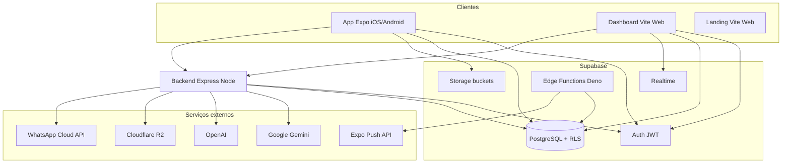
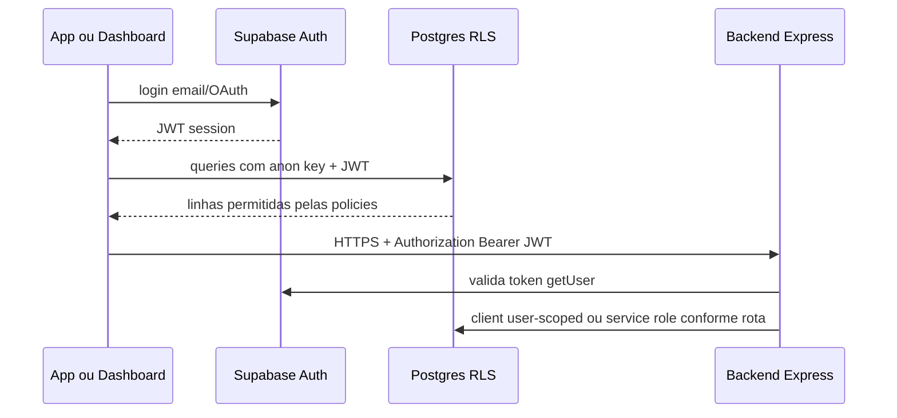
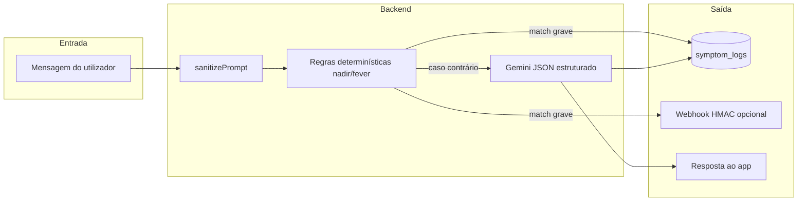
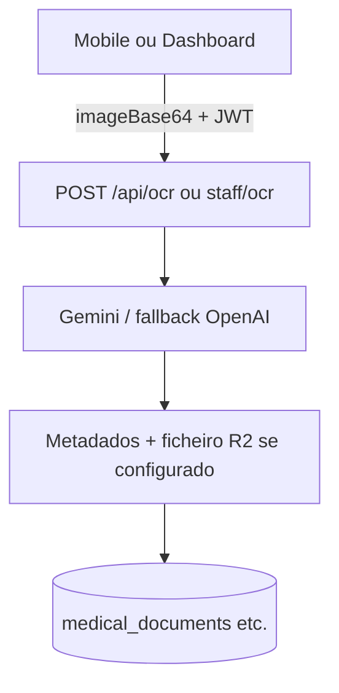

# Aura Onco — Plataforma de acompanhamento oncológico

**Um dia de cada vez** · HealthTech / orientação **SaMD** · Monorepo com app **Expo**, **dashboard hospitalar**, **API Node**, **Supabase** e **IA** (Gemini / OpenAI).

Este repositório está documentado para **onboarding de engenharia**, **revisão de arquitetura** e **contexto de contratação**: abaixo tens visão de produto, stack, fluxos, índice completo de `docs/` e arranque local.

---

## Índice

1. [Visão do produto](#1-visão-do-produto)
2. [Arquitetura do sistema](#2-arquitetura-do-sistema)
3. [Fluxos principais (diagramas)](#3-fluxos-principais-diagramas)
4. [Estrutura do monorepo](#4-estrutura-do-monorepo)
5. [Stack tecnológica](#5-stack-tecnológica)
6. [Biblioteca de documentação (`docs/`)](#6-biblioteca-de-documentação-docs)
7. [Arranque rápido (desenvolvimento)](#7-arranque-rápido-desenvolvimento)
8. [Segurança e compliance (resumo)](#8-segurança-e-compliance-resumo)
9. [Roadmap e relatório](#9-roadmap-e-relatório)

---

## 1. Visão do produto

| Público | Valor |
|--------|--------|
| **Paciente** | Diário de sintomas, medicamentos, ciclos de tratamento, exames (OCR), calendário, relatórios PDF, consentimentos LGPD. |
| **Hospital / equipa** | Dashboard web de triagem, vínculo autorizado ao prontuário, mensagens (ex.: WhatsApp via backend), auditoria. |
| **Futuro** | RWE / evidência do mundo real para decisões clínicas e operações (roadmap em [`TODO_MASTER.md`](TODO_MASTER.md)). |

**Princípio clínico da IA:** suporte e triagem, **sem diagnóstico automático** — alinhado a [`docs/diretrizes-corportamento.md`](docs/diretrizes-corportamento.md).

---

## 2. Arquitetura do sistema

### 2.1 Contexto (C4 — nível contentor)



A **landing** (`landing-page-onco`) é uma SPA estática de marketing — não aparece ligada a Supabase nem ao Express neste diagrama.

- **Fonte de verdade dos dados:** PostgreSQL no Supabase, com **Row Level Security** por utilizador e por vínculo hospitalar.
- **Backend Express:** rotas que precisam de segredos de servidor (OCR, LLM, R2, WhatsApp), sempre com **Bearer JWT** do Supabase nas rotas autenticadas.
- **Edge Functions:** tarefas agendadas / internas (lembretes push, notificação de pedido de vínculo), com **service role** e proteção por **`CRON_SECRET`** — ver [`supabase/functions/README.md`](supabase/functions/README.md).

### 2.2 Camadas lógicas

| Camada | Responsabilidade |
|--------|------------------|
| **Apresentação** | Expo (paciente), Vite+React (dashboard, landing). |
| **API aplicacional** | Express: validação (Zod), rate limit, orquestração IA, storage R2. |
| **Dados** | Supabase Postgres + RLS; RPCs e triggers para regras e auditoria. |
| **Integrações** | Gemini/OpenAI, Meta WhatsApp, Expo Push, webhooks assinados (alertas). |

---

## 3. Fluxos principais (diagramas)

### 3.1 Autenticação e acesso aos dados (mobile / dashboard)



### 3.2 Assistente de sintomas e regra de emergência (nadir + febre)



### 3.3 OCR de exames (resumo)



---

## 4. Estrutura do monorepo

| Pasta | Descrição | README local |
|-------|-----------|--------------|
| [`mobile/`](mobile/) | App **Expo Router** — paciente | [`mobile/README.md`](mobile/README.md) |
| [`hospital-dashboard/`](hospital-dashboard/) | **SPA** equipa clínica + Realtime | [`hospital-dashboard/README.md`](hospital-dashboard/README.md) |
| [`landing-page-onco/`](landing-page-onco/) | Site marketing | [`landing-page-onco/README.md`](landing-page-onco/README.md) |
| [`backend/`](backend/) | **Express**: agente, OCR, exames, WhatsApp, suporte | Ver secção 7 + [`backend/.env.example`](backend/.env.example) |
| [`supabase/migrations/`](supabase/migrations/) | Schema evolutivo, RLS, funções | Aplicar em ordem ao projeto Supabase |
| [`supabase/functions/`](supabase/functions/) | Edge Functions (lembretes, notify) | [`supabase/functions/README.md`](supabase/functions/README.md) |
| [`docs/`](docs/) | Especificações de produto, BD, IA, segurança | Tabela abaixo |

Não existe `package.json` na **raiz**; cada app é um projeto Node independente.

---

## 5. Stack tecnológica

| Área | Tecnologias |
|------|-------------|
| Mobile | Expo ~54, expo-router, React, TypeScript, TanStack Query, Supabase JS |
| Dashboard / Landing | Vite, React 19, React Router 7; landing com Tailwind v4 |
| Backend | Node, Express, Helmet, CORS, express-rate-limit, Zod, Gemini & OpenAI SDKs, AWS SDK (R2) |
| Dados & auth | Supabase (PostgreSQL, Auth, Storage, Realtime), RLS |
| IA | Google Gemini (triagem JSON), OpenAI (suporte, fallback OCR) |
| Infra opcional | Cloudflare R2, WhatsApp Cloud API, Expo Push |

---

## 6. Biblioteca de documentação (`docs/`)

| Documento | Conteúdo |
|-----------|----------|
| [`docs/RELATORIO-PROJETO.md`](docs/RELATORIO-PROJETO.md) | Relatório executivo do repositório (arquitetura, integrações, roadmap resumido) |
| [`docs/visao-geral-projeto.md`](docs/visao-geral-projeto.md) | Visão estratégica B2B2C, pilares do produto |
| [`docs/documentacao-tecnica.md`](docs/documentacao-tecnica.md) | Produto, brand/design system (Apple Health), princípios de UI |
| [`docs/arquitetura-bd.md`](docs/arquitetura-bd.md) | Modelo relacional, entidades, enums |
| [`docs/politicas-compliance.md`](docs/politicas-compliance.md) | LGPD, retenção, bases legais |
| [`docs/SECURITY.md`](docs/SECURITY.md) | Práticas de segurança Supabase e app |
| [`docs/diretrizes-corportamento.md`](docs/diretrizes-corportamento.md) | Comportamento seguro da IA clínica (sem diagnóstico) |
| [`docs/analise-de-modelos-ia.md`](docs/analise-de-modelos-ia.md) | Modelos, compliance clínica, Vertex/BAA (notas) |
| [`docs/orquestrador.md`](docs/orquestrador.md) | Visão do agente orquestrador ReAct / tools |
| [`docs/style-guide.md`](docs/style-guide.md) | Guia visual / tokens |
| [`docs/data-contract-dashboard.md`](docs/data-contract-dashboard.md) | Contrato de dados dashboard hospitalar |
| [`docs/hospital-dashboard-sprint.md`](docs/hospital-dashboard-sprint.md) | Sprint dashboard |
| [`docs/sprints-dashboard-hospital.md`](docs/sprints-dashboard-hospital.md) | Sprints hospital |
| [`docs/sgq/README.md`](docs/sgq/README.md) | **SGQ** — qualidade, ISO 14971 / IEC 62304, LGPD (BPF / RDC 665) |
| [`prd-onco-app.md`](prd-onco-app.md) | PRD MVP (user stories, fluxos) |
| [`TODO_MASTER.md`](TODO_MASTER.md) | Backlog: concluído vs pendente |

---

## 7. Arranque rápido (desenvolvimento)

Ordem recomendada: **Supabase** → **backend** → **mobile** e/ou **dashboard**.

### 7.1 Banco de dados (Supabase)

1. Criar projeto em [supabase.com](https://supabase.com).
2. Aplicar migrações em [`supabase/migrations/`](supabase/migrations/) (por ordem cronológica), ou `supabase db push` com CLI ligada ao projeto.
3. Confirmar RLS e trigger `on_auth_user_created` → `profiles` (schema inicial).

### 7.2 Backend

```bash
cd backend
cp .env.example .env
# Preencher SUPABASE_URL, SUPABASE_ANON_KEY, GEMINI_API_KEY, etc.
npm install
npm run dev
```

- Saúde: `GET http://localhost:3001/api/health` (porta padrão **3001**).
- Em **produção**, `NODE_ENV=production` exige **`CORS_ORIGINS`** definido (senão o processo termina ao iniciar).
- Webhook de alerta: `HOSPITAL_ALERT_WEBHOOK_URL` + `HOSPITAL_ALERT_WEBHOOK_SECRET` (HMAC no header `X-Webhook-Signature`).

### 7.3 Mobile

```bash
cd mobile
# Criar .env com EXPO_PUBLIC_SUPABASE_URL, EXPO_PUBLIC_SUPABASE_ANON_KEY, EXPO_PUBLIC_API_URL
npm install
npx expo start
```

- `EXPO_PUBLIC_API_URL` deve apontar para o backend (ex.: `http://localhost:3001` ou IP da LAN / `10.0.2.2` no emulador Android).
- Detalhes: [`mobile/README.md`](mobile/README.md).

### 7.4 Hospital dashboard

```bash
cd hospital-dashboard
# .env: VITE_SUPABASE_URL, VITE_SUPABASE_ANON_KEY, VITE_BACKEND_URL
npm install
npm run dev
```

### 7.5 Landing

```bash
cd landing-page-onco
npm install
npm run dev
```

### 7.6 Fluxo de teste manual (happy path)

1. Registo no app → perfil criado pelo trigger.
2. Cadastro de paciente / vínculo conforme migrações e UI.
3. Diário → `symptom_logs`; assistente → backend + Gemini; cenário **nadir + febre** → mensagem de emergência + opcional webhook assinado.
4. Dashboard → leitura de pacientes autorizados + Realtime (conforme políticas).

---

## 8. Segurança e compliance (resumo)

- **Segredos:** nunca commitar `.env`; usar variáveis no CI/CD e na cloud.
- **RLS:** isolamento por `auth.uid()` e vínculos `patient_hospital_links` — detalhes nas migrações e em [`docs/arquitetura-bd.md`](docs/arquitetura-bd.md).
- **API Express:** JWT obrigatório nas rotas privadas; validação Zod; rate limiting; webhook WhatsApp com **X-Hub-Signature-256**.
- **Edge Functions:** `CRON_SECRET` + `Authorization: Bearer` — [`supabase/functions/README.md`](supabase/functions/README.md).
- **IA:** input sanitizado antes do LLM; saída estruturada validada onde aplicável.
- Leitura obrigatória para auditoria: [`docs/SECURITY.md`](docs/SECURITY.md), [`docs/politicas-compliance.md`](docs/politicas-compliance.md).
- **Gestão da qualidade e rastreabilidade:** [`docs/sgq/README.md`](docs/sgq/README.md) (processos ISO 14971, IEC 62304, LGPD; template de PR em [`.github/PULL_REQUEST_TEMPLATE.md`](.github/PULL_REQUEST_TEMPLATE.md)).

---

## 9. Roadmap e relatório

- **Backlog detalhado:** [`TODO_MASTER.md`](TODO_MASTER.md) (inclui itens de segurança já implementados e pendências).
- **Relatório único do projeto:** [`docs/RELATORIO-PROJETO.md`](docs/RELATORIO-PROJETO.md).

---

## Licença e contribuição

Repositório **privado / confidencial** conforme classificação dos documentos em `docs/`. Ajustar licença e guia de contribuição quando o projeto for aberto a terceiros.

---

*README mantido para apresentação técnica coerente com a documentação em `docs/`. Atualizar ao alterar arquitetura ou novos serviços.*
