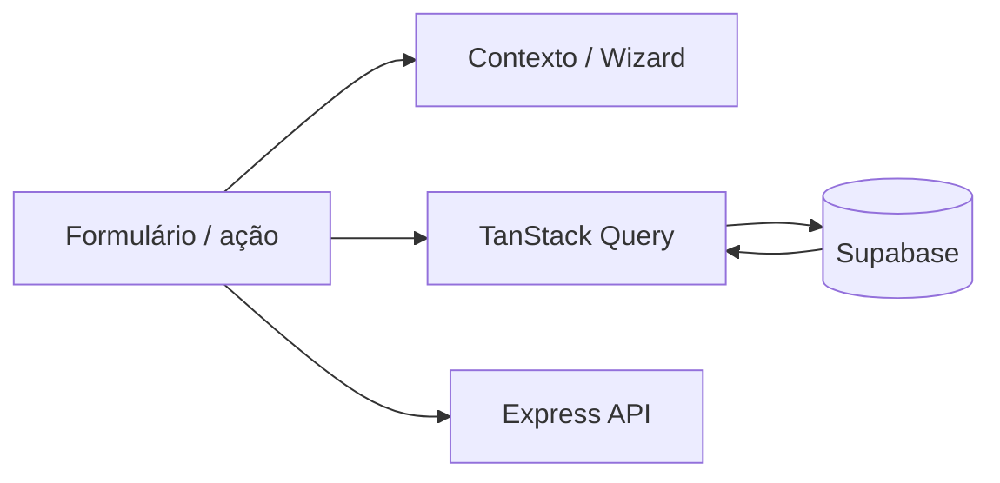

# Auditoria QA — Aura Onco Mobile (ponta a ponta)

**Data:** 2026-04-15  
**Stack:** Expo Router 6, React 19, TanStack Query 5, Supabase JS, Express (`backend/`) para OCR/agent/exames.

Este documento consolida o mapeamento de UI, rastreabilidade de funções, ciclo de vida de dados, dashboard, erros, checklist manual e **alterações implementadas** nesta sprint de QA.

---

## 1. Mapeamento de UI e navegação

### 1.1 Inventário de rotas (`mobile/app/**/*.tsx`)

**Total: 50 ficheiros de rota** (confirmado por glob).

| Área | Rotas |
|------|--------|
| Raiz | `index.tsx`, `login.tsx`, `onboarding.tsx`, `lgpd-consent.tsx`, `calendar.tsx`, `authorizations.tsx`, `reports.tsx`, `caregiver-claim.tsx`, `+not-found.tsx`, `+html.tsx`, `auth/callback.tsx` |
| Tabs | `(tabs)/index.tsx` (Resumo), `diary.tsx`, `education.tsx`, `agent.tsx` |
| Exames | `(tabs)/exams/index.tsx`, `(tabs)/exams/[id].tsx` |
| Saúde | `health/index.tsx`, medicamentos (`index`, `name`, `type`, `dosage`, `shape`, `color`, `schedule`, `review`, `detail`), vitais (`index`, `[type]`, `log`), nutrição (`index`, `log`) |
| Tratamento | `treatment/index`, `kind`, `name`, `details`, `schedule`, `[cycleId]/index`, `edit`, `checkin`, `infusion/new`, `infusion/[infusionId]` |

### 1.2 Tab bar e rotas “ocultas”

- [`mobile/app/(tabs)/_layout.tsx`](mobile/app/(tabs)/_layout.tsx): pill custom (`FloatingPillTabBar`) — entradas visíveis principais: **Resumo**, **Exames**, atalho **Buscar** → hub Saúde.
- `treatment`, `diary`, `agent`, `education` mantêm-se no navigator com `href: null` (não são botões da tab bar); acesso só por links internos.

### 1.3 Modais e bottom sheets

| Componente | Tipo | Acionamento típico |
|--------------|------|---------------------|
| `ProfileSheet` | `@gorhom/bottom-sheet` | Avatar no Resumo |
| `WidgetPickerModal` | `BottomSheetModal` (custom) | “Ajustar” métricas em foco |
| `OcrReviewBottomSheet` | Bottom sheet | Fluxo OCR de exames |
| `EmergencyModal`, `SelfCareModal` | `Modal` RN | Diário / `SymptomQuickLog` |
| Detalhe de medicamento | Modal em `medications/index.tsx` | Lista de medicamentos |

### 1.4 Becos sem saída (dead-ends)

| Risco | Estado |
|-------|--------|
| Erro ao carregar paciente no gate | **Corrigido:** [`mobile/app/index.tsx`](mobile/app/index.tsx) mostra mensagem + “Tentar novamente” em vez de `Redirect` silencioso para `/(tabs)`. |
| Stacks aninhados (wizard medicamento/tratamento) | Cada stack tem header/back do React Navigation; validar manualmente em dispositivo. |

---

## 2. Rastreabilidade de funções (por ecrã crítico)

| Ecrã | Interação | Caminho técnico | Persistência / API |
|------|-----------|-----------------|---------------------|
| Resumo | Abrir | `useHomeSummary` → [`fetchHomeSummarySnapshot`](mobile/src/home/fetchHomeSummarySnapshot.ts) | **1×** `supabase.rpc('rpc_mobile_home_summary')` (bundle JSON); se falhar ou payload inválido → **fallback** [`fetchHomeSummarySnapshotParallel`](mobile/src/home/fetchHomeSummarySnapshot.ts) (8× `from` + `profiles`) + tag Sentry `rpc_fallback` |
| Resumo | Pull-to-refresh | `RefreshControl` → `refreshSummary` + `refreshMeds` + `loadInfusions` | Invalidação RQ + infusões locais |
| Resumo | Marcar dose | `markMedicationTaken` → `medication_logs.insert` | Supabase + invalidação meds + home summary |
| Onboarding | Guardar | `savePatient` + **Zod** [`onboardingPatientInsertSchema`](mobile/src/validation/onboardingPatient.ts) | `profiles` + `patients` |
| Medicamentos / review | Guardar | `save()` + validação **Zod** (nome) | `medications` + `medication_schedules` |
| Diário | Registo sintoma | `SymptomQuickLog` | `symptom_logs` |
| Exames | OCR | `fetch` → `POST /api/ocr/analyze` | Backend Express |
| Exames / detalhe | Ver/partilhar | `GET /api/exams/:id/view`, `share` | Express + R2 |
| Agente | Chat | `POST /api/support/chat` ou `/api/agent/process` | Express |
| Cuidador | Código | `rpc("claim_caregiver_pairing")` | Supabase RPC |

---

## 3. Ciclo de vida da informação

| Dado | Estado | Invalidação |
|------|--------|---------------|
| Paciente | `["patient", uid]` em `PatientContext` | `invalidateQueries(["patient", …])` + **`["homeSummary"]`** (via [`useInvalidatePatient`](mobile/src/patient/PatientContext.tsx)) |
| Resumo agregado | `["homeSummary", patientId]` | `refresh()` = `invalidateQueries` na key |
| Medicamentos | `["medications", patientId]` | `useMedications().refresh` |

**Alteração implementada:** `useHomeSummary` passou de `useState` + `useEffect` para **TanStack Query** com `placeholderData: keepPreviousData`, erros propagados (`isError` / `error`) e `fetchHomeSummarySnapshot` com `assertNoError` por query Supabase.

---

## 4. Auditoria do Dashboard (Resumo)

### 4.1 Origem dos dados (por consulta)

**Caminho preferido (RPC ativa):** uma chamada **`rpc_mobile_home_summary(p_patient_id)`** agrega no servidor o mesmo bundle que o cliente montava em paralelo (perfil, ciclo ativo, biomarkers, sintomas, documentos, vitais, nutrição, próxima consulta).

**Fallback (RPC indisponível ou payload inválido):** `fetchHomeSummarySnapshotParallel` dispara **9 leituras** em paralelo:

1. `profiles` (utilizador autenticado)
2. `treatment_cycles` (ativo)
3. `biomarker_logs`
4. `symptom_logs`
5. `medical_documents` (biopsy flag)
6. `medical_documents` (último doc)
7. `vital_logs`
8. `nutrition_logs`
9. `patient_appointments`

**Adicionalmente no mesmo ecrã:** `useMedications`, `useTreatmentCycles` / `fetchInfusions`, `useProtocolMonitoring` — no teste de stress, contar **1 RPC resumo** + estes pedidos (meds / infusões / protocolo), não mais 9+ para o bundle principal quando a RPC responde OK.

### 4.2 Sincronização e consistência

- **Foco:** `useFocusEffect` no Resumo (throttle 15s) chama `refreshSummary`, `refreshMeds`, `loadInfusions`; erros não bloqueantes usam **toast** ([`showAppToast`](mobile/src/lib/appToast.ts)).
- **Rede / foco app:** [`OnlineManagerBridge`](mobile/src/components/OnlineManagerBridge.tsx) liga `onlineManager` e `focusManager` ao NetInfo + AppState; [`queryClient`](mobile/src/lib/queryClient.ts) com `refetchOnReconnect` e `refetchOnWindowFocus`.
- **Consistência totais vs listas:** widgets derivam do último snapshot do resumo; após alteração noutro separador, depende de refetch (foco ou pull). **Teste manual recomendado** (checklist §6.3).

### 4.3 RPC consolidada (base de dados)

- Migração ativa: [`supabase/migrations/20260520140000_rpc_mobile_home_summary.sql`](supabase/migrations/20260520140000_rpc_mobile_home_summary.sql) — **`rpc_mobile_home_summary(p_patient_id uuid) RETURNS jsonb`**, `SECURITY INVOKER`, `search_path = public`; remove o placeholder `rpc_mobile_home_summary_ping`.
- Histórico: [`20260418140000_mobile_home_summary_rpc_ping.sql`](supabase/migrations/20260418140000_mobile_home_summary_rpc_ping.sql) (placeholder antigo; a função `ping` é removida pela migração acima).
- Cliente: [`parseHomeSummaryRpc.ts`](mobile/src/home/parseHomeSummaryRpc.ts) valida o JSON; fallback paralelo + [`setRpcFallbackTag`](mobile/src/lib/sentry.ts) no Sentry.
- RLS (manual): roteiro em [`supabase/tests/rpc_mobile_home_summary_rls.sql`](../supabase/tests/rpc_mobile_home_summary_rls.sql).

---

## 5. Tratamento de erros e casos de limite

| Cenário | Comportamento após alterações |
|---------|-----------------------------|
| Falha Supabase no resumo | `isError` + cartão “Resumo indisponível” + retry no [`(tabs)/index.tsx`](mobile/app/(tabs)/index.tsx) |
| Falha fetch paciente (gate) | Ecrã dedicado com retry ([`app/index.tsx`](mobile/app/index.tsx)) |
| Offline | [`NetworkStatusBanner`](mobile/src/components/NetworkStatusBanner.tsx) (NetInfo / `window` na web) |
| Carregamento padronizado | [`ScreenLoading`](mobile/src/components/ScreenLoading.tsx) no gate |
| Validação onboarding | Zod em [`onboardingPatient.ts`](mobile/src/validation/onboardingPatient.ts) |
| Nome medicamento (review) | Zod `safeParse` em [`review.tsx`](mobile/app/(tabs)/health/medications/review.tsx) |

**Implementado nesta linha de sprints:** Sentry (`initSentry`, `AppErrorBoundary`, `instrumentedFetch` em rotas críticas), toasts para erros leves no Resumo/exames/OCR/sintomas, **fila offline** MVP (`enqueueVitalLog` / `enqueueSymptomLog` + flush em [`OnlineManagerBridge`](mobile/src/components/OnlineManagerBridge.tsx)).

---

## 6. Checklist de execução manual (equipa)

### 6.1 Superfície (navegação cega)

- [ ] Percorrer as 50 rotas e todos os CTAs.
- [ ] Abrir todos os bottom sheets/modais listados em §1.3.
- [ ] Submeter formulários vazios / inválidos (onboarding, vitals, nutrição, review medicamento).

### 6.2 Sangria de dados

- [ ] Criar paciente; inspecionar `patients` + `profiles` no Supabase.
- [ ] Registar sintoma / vital / medicamento; validar `*_logs` / tabelas relacionadas.

### 6.3 Dashboard

- [ ] Contar pedidos de rede no primeiro load do Resumo (DevTools / proxy).
- [ ] Alterar dado noutro separador → voltar ao Resumo em < 15s ou usar pull-to-refresh.
- [ ] Conferir totais de widgets vs listas detalhadas.

### 6.4 Stress

- [ ] Modo avião durante submit.
- [ ] Troca rápida de separadores.
- [ ] Sessão expirada → fluxo de login.

---

## 7. Gargalos e otimizações sugeridas

1. **E2E CI:** job que instala Maestro e corre `npm run e2e:maestro` num emulador (opcional).
2. **Fila offline:** alargar a mais mutações, idempotência / `client_mutation_id`.
3. **Segurança de config:** chaves Supabase retiradas do `app.json` estático; usar só EAS Secrets + `app.config.js` (ver guia Play Store, Parte 3).

---

## 8. Relatório final — alterações de código (sprint)

| Ficheiro / área | O quê |
|-----------------|--------|
| [`app/index.tsx`](mobile/app/index.tsx) | Gate de erro do paciente com UI + retry |
| [`app/_layout.tsx`](mobile/app/_layout.tsx) | `NetworkStatusBanner`, `OnlineManagerBridge`, Toast global, bootstrap Sentry |
| [`app/(tabs)/index.tsx`](mobile/app/(tabs)/index.tsx) | Pull-to-refresh, skeleton inicial do resumo, toasts em erros de foco/refresh |
| [`src/home/fetchHomeSummarySnapshot.ts`](mobile/src/home/fetchHomeSummarySnapshot.ts) | RPC `rpc_mobile_home_summary` + fallback paralelo + tag Sentry |
| [`src/home/parseHomeSummaryRpc.ts`](mobile/src/home/parseHomeSummaryRpc.ts) | Validação do payload JSON da RPC |
| [`src/home/HomeSummarySkeleton.tsx`](mobile/src/home/HomeSummarySkeleton.tsx) | Placeholders no carregamento do resumo |
| [`src/home/homeSummaryTypes.ts`](mobile/src/home/homeSummaryTypes.ts) | Tipos + serialização de Maps para RQ |
| [`src/home/useHomeSummary.ts`](mobile/src/home/useHomeSummary.ts) | TanStack Query + `homeSummaryQueryKey` |
| [`src/patient/PatientContext.tsx`](mobile/src/patient/PatientContext.tsx) | `useInvalidatePatient` também invalida `homeSummary` |
| [`src/lib/queryClient.ts`](mobile/src/lib/queryClient.ts) | `refetchOnReconnect`, `refetchOnWindowFocus` |
| [`src/lib/sentry.ts`](mobile/src/lib/sentry.ts), [`sentry.bootstrap.ts`](mobile/src/lib/sentry.bootstrap.ts) | Init Sentry, breadcrumbs, `setRpcFallbackTag` |
| [`src/lib/instrumentedFetch.ts`](mobile/src/lib/instrumentedFetch.ts) | `fetch` com telemetria para Express |
| [`src/lib/appToast.ts`](mobile/src/lib/appToast.ts) | Toasts centralizados |
| [`src/lib/offlineMutationQueue.ts`](mobile/src/lib/offlineMutationQueue.ts) | Fila AsyncStorage + flush |
| [`src/hooks/useVitalLogs.ts`](mobile/src/hooks/useVitalLogs.ts) | Enfileira vital offline quando sem rede |
| [`src/components/AppErrorBoundary.tsx`](mobile/src/components/AppErrorBoundary.tsx) | Reporta erros React ao Sentry |
| [`src/components/ScreenLoading.tsx`](mobile/src/components/ScreenLoading.tsx) | Loading padronizado |
| [`src/components/NetworkStatusBanner.tsx`](mobile/src/components/NetworkStatusBanner.tsx) | Deteção offline |
| [`src/components/OnlineManagerBridge.tsx`](mobile/src/components/OnlineManagerBridge.tsx) | NetInfo + AppState ↔ TanStack + flush da fila offline |
| [`src/diary/SymptomQuickLog.tsx`](mobile/src/diary/SymptomQuickLog.tsx) | Sintoma offline → fila + toast |
| [`app/(tabs)/health/vitals/log.tsx`](mobile/app/(tabs)/health/vitals/log.tsx) | Vital offline → fila + toast |
| [`src/validation/onboardingPatient.ts`](mobile/src/validation/onboardingPatient.ts) | Schema Zod onboarding |
| [`app/onboarding.tsx`](mobile/app/onboarding.tsx) | Uso do schema antes do insert |
| [`app/(tabs)/health/medications/review.tsx`](mobile/app/(tabs)/health/medications/review.tsx) | Validação Zod do nome |
| [`app.config.js`](mobile/app.config.js) | `extra` (Supabase, API, Sentry), plugins Sentry |
| [`app.json`](mobile/app.json) | Sem chaves Supabase em `extra` estático (EAS + `app.config.js`) |
| [`maestro/smoke.yaml`](mobile/maestro/smoke.yaml) | Smoke E2E Maestro (`appId: com.auraonco.app`) |
| [`supabase/migrations/20260520140000_rpc_mobile_home_summary.sql`](supabase/migrations/20260520140000_rpc_mobile_home_summary.sql) | RPC bundle resumo + `DROP` ping |
| [`supabase/migrations/20260418140000_mobile_home_summary_rpc_ping.sql`](supabase/migrations/20260418140000_mobile_home_summary_rpc_ping.sql) | Histórico placeholder (função removida pela migração acima) |
| `package.json` | `zod`, `@react-native-community/netinfo`, `@sentry/react-native`, `react-native-toast-message`, script `e2e:maestro` |

**Comando de verificação:** `cd mobile && npm run typecheck`

---

## 9. Referências cruzadas

- Backend HTTP: [`backend/src/index.ts`](../backend/src/index.ts)
- Migrações Supabase: [`supabase/migrations/`](../supabase/migrations/)
- CI: [`.github/workflows/ci.yml`](../.github/workflows/ci.yml)
