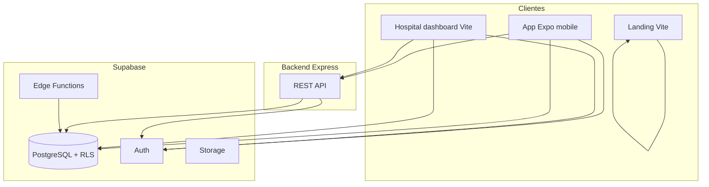

# Relatório do projeto Aura Onco

Síntese do repositório **aura-onco**, alinhada ao README, PRD, `TODO_MASTER.md` e à estrutura do código.

---

## 1. Identidade e posicionamento

| Campo | Descrição |
|--------|------------|
| **Nome / produto** | **Onco** — acompanhamento oncológico no dia a dia (“um dia de cada vez”). |
| **Tipo** | HealthTech / orientação SaMD: app para paciente + caminho B2B (dashboard hospitalar). |
| **Stack declarada** | Expo (React Native), Supabase (PostgreSQL, Auth, RLS, Storage, Edge Functions), backend **Node/Express**, IA (**Gemini** / **OpenAI** conforme rotas). |
| **Repositório** | Monorepo sem `package.json` na raiz: cada aplicação é um projeto Node independente. |

---

## 2. Problema e solução (produto)

- **Problema:** fadiga, “chemo brain”, rotina pesada de medicamentos, sintomas e consultas geram registos fracos e comunicação difícil com a equipa clínica.
- **Solução:** centralizar **diário de sintomas**, **medicamentos**, **ciclos/tratamento**, **calendário** e **relatórios PDF**, com baixa fricção e regras de alerta (ex.: nadir + febre).
- **Futuro B2B:** dados com consentimento para **triagem** e **dashboard hospitalar** (RWE), já preparado no modelo de dados e no dashboard Vite.

---

## 3. Arquitetura técnica (visão geral)

- **Autenticação:** Supabase Auth (JWT); o backend valida sessão via `Authorization: Bearer` + `auth.getUser()`.
- **Dados sensíveis:** RLS no Postgres; funções `SECURITY DEFINER` para operações controladas (auditoria, RPC).
- **Ficheiros de exames:** fluxo com **Cloudflare R2** (S3-compatible) no backend quando configurado; caso contrário metadados/OCR inline conforme implementação.

---

## 4. Componentes do repositório

### 4.1 Mobile (`mobile/`)

- **Expo Router**, React, TanStack Query em parte dos fluxos, Context (Auth, Patient, wizard de medicamentos).
- **Áreas principais:** login/OAuth (Google, Apple, email), LGPD, diário com gráficos, saúde (medicamentos com wizard, nutrição, sinais vitais), tratamento (ciclos, infusões, check-in), exames/OCR, calendário, relatórios PDF, vinculação hospitalar / autorizações.
- **Push:** token Expo em `profiles`; lembretes também disparados por Edge Functions.

### 4.2 Backend (`backend/`)

- **Express:** Helmet, CORS configurável, rate limit em rotas sensíveis.
- **Rotas exemplares:** saúde, chat de suporte (OpenAI), agente de sintomas (Gemini + regras nadir/febre), OCR, rotas de exames (R2/presigned), WhatsApp (envio + webhook Meta com verificação de assinatura).
- **Endurecimento:** sanitização de input para LLM, webhook de emergência com **HMAC** (`HOSPITAL_ALERT_WEBHOOK_SECRET`) e sem texto livre do paciente no payload, respostas de erro genéricas ao cliente, idempotência opcional (`Idempotency-Key`), em produção exige **`CORS_ORIGINS`**.

### 4.3 Hospital dashboard (`hospital-dashboard/`)

- **Vite + React**, Supabase client direto, **Realtime** para triagem, UI concentrada em `App.tsx` (pacientes, sintomas, exames, mensagens, auditoria, integrações).
- Ligação ao backend para OCR, WhatsApp e downloads de exames (`VITE_BACKEND_URL`).

### 4.4 Landing (`landing-page-onco/`)

- Site de marketing (React Router), **Error Boundary** para evitar SPA em branco em erro global.

### 4.5 Supabase

- **`migrations/`:** schema evolutivo (perfil, hospitais, staff, pacientes, sintomas, documentos, biomarcadores, WhatsApp, vínculos paciente–hospital, consentimentos, tratamento/infusões, vitals/nutrição, lembretes, etc.).
- **`functions/`:** lembretes de medicamentos e de tratamento, notificação de pedido de vínculo; autenticação por **`CRON_SECRET`** + `Authorization: Bearer`; ver [`functions/README.md`](../supabase/functions/README.md).

---

## 5. Dados, integridade e segurança

- **RLS:** políticas por dono do perfil, staff por hospital e, onde aplicável, por **`patient_hospital_links`** (aprovado / read_write).
- **DELETE em `patients`:** migração `20260501120000_patients_delete_hospital_admin_only.sql` restringe a **hospital_admin** com vínculo read_write.
- **Auditoria:** `audit_logs` + RPCs como `record_audit`, `staff_audit_logs_list`.
- **Compliance:** [`politicas-compliance.md`](politicas-compliance.md), [`diretrizes-corportamento.md`](diretrizes-corportamento.md).
- **Segurança operacional:** [`SECURITY.md`](SECURITY.md); webhook Meta com **X-Hub-Signature-256**.

---

## 6. Integrações externas

| Integração | Uso |
|------------|-----|
| **Google Gemini** | Triagem estruturada (JSON) no fluxo do agente. |
| **OpenAI** | Suporte ao utilizador e fallback de OCR. |
| **WhatsApp Cloud API** | Mensagens outbound (opt-in; service role onde necessário). |
| **Expo Push** | Edge Functions → API de push Expo. |
| **Webhooks** | Alerta hospitalar (HMAC); destino pode ser n8n ou outro serviço. |
| **R2** | Armazenamento de ficheiros de exames. |

---

## 7. Documentação no repositório

| Área | Ficheiros |
|------|-----------|
| Visão e BD | [`visao-geral-projeto.md`](visao-geral-projeto.md), [`arquitetura-bd.md`](arquitetura-bd.md) |
| IA e compliance | [`diretrizes-corportamento.md`](diretrizes-corportamento.md), [`analise-de-modelos-ia.md`](analise-de-modelos-ia.md), [`politicas-compliance.md`](politicas-compliance.md) |
| Dashboard | [`hospital-dashboard-sprint.md`](hospital-dashboard-sprint.md), [`data-contract-dashboard.md`](data-contract-dashboard.md) |
| Segurança | [`SECURITY.md`](SECURITY.md) |
| Raiz | [`../README.md`](../README.md), [`../prd-onco-app.md`](../prd-onco-app.md), [`../TODO_MASTER.md`](../TODO_MASTER.md) |

---

## 8. Estado do roadmap

Ver [`../TODO_MASTER.md`](../TODO_MASTER.md) para o detalhe. Em resumo:

- **MVP (PRD):** épicos principais concluídos (onboarding, medicamentos, diário, tratamento, relatórios, calendário, vínculo hospital).
- **Pendências exemplares:** deep linking universal, testes E2E, onboarding guiado, dark mode completo, auditoria a11y no mobile, testes RLS integrados, cron de consultas, Realtime filtrado por hospital, métricas agregadas, wearables, i18n, analytics.

---

## 9. Operação (checklist)

- **Supabase:** secrets (`CRON_SECRET` para Edge Functions; invocações com `Authorization: Bearer`).
- **Backend produção:** `CORS_ORIGINS`; chaves API; opcionalmente `HOSPITAL_ALERT_WEBHOOK_URL` + **`HOSPITAL_ALERT_WEBHOOK_SECRET`** e validação HMAC no receptor.
- **Clientes:** `EXPO_PUBLIC_*` / `VITE_*` por app; não commitar `.env` com segredos reais. Ver [`../backend/.env.example`](../backend/.env.example).

---

## 10. Conclusão

O **Aura Onco** é um **monorepo de produto clínico** com três faces (paciente mobile, equipa no dashboard web, landing), **núcleo de dados no Supabase** com RLS e **serviço Express** para OCR, IA, ficheiros e WhatsApp. Endurecimentos recentes incluem segredos nas Edge Functions, API e webhooks mais restritivos, e políticas de DELETE mais controladas para alinhar a operação a dados de saúde.

---

*Documento gerado para referência interna do projeto. Atualizar quando o roadmap ou a arquitetura mudarem de forma material.*
