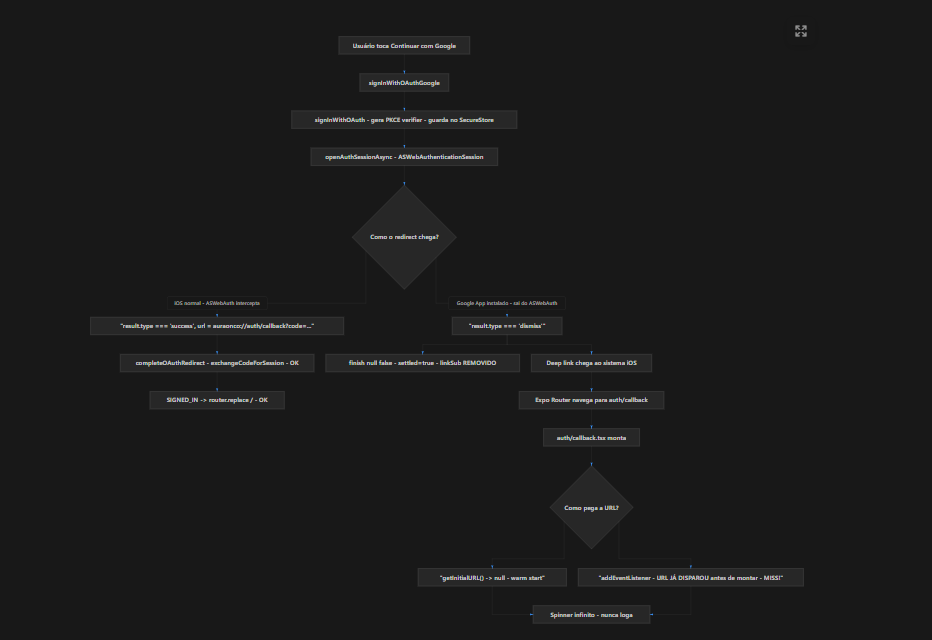
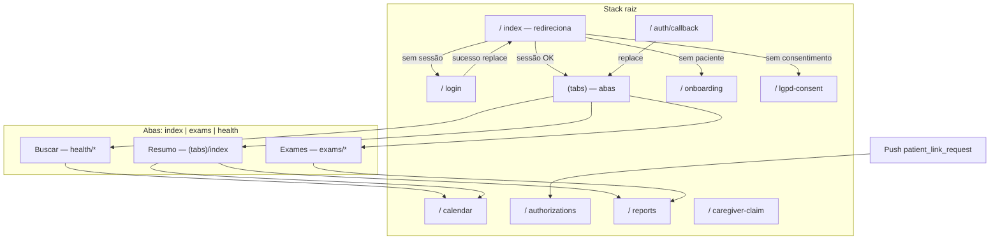

# Plano de navegação — Aura Onco (app mobile)

Documento de referência do **fluxo por ecrã**, **stack global**, **abas inferiores** e **para onde cada ação navega**. Baseado no código em `mobile/app` (Expo Router) e hooks como `useStackBack`.

---

## Diagramas: Mermaid + imagens (fluxogramas)

Para **visualizar melhor** ramificações (decisões, caminho feliz vs falha, paralelos iOS/Android), este documento combina:

1. **Diagramas Mermaid** (texto no próprio `.md`, versionável).
2. **Imagens PNG** em [`docs/assets/`](assets/) — úteis quando o fluxo é denso (muitas caixas, notas técnicas, cores) ou quando exportas de Figma/Whimsical/Excalidraw.

**Como adicionar uma nova figura:** guarda o ficheiro em `docs/assets/nome-descritivo.png` e referencia com:

```markdown

```

No GitHub / VS Code / Cursor a imagem aparece inline acima das tabelas de rotas.

### Exemplo (referência visual): OAuth «Continuar com Google»

Fluxograma do login Google: **disparo** → `signInWithOAuth` (PKCE no `SecureStore`) → `openAuthSessionAsync` → decisão **«Como o redirect chega?»**

- **Caminho A (iOS típico):** `ASWebAuthenticationSession` intercepta → `result.type === 'success'` com `auraonco://auth/callback?code=...` → `completeOAuthRedirect` → `SIGNED_IN` → `router.replace('/')`.
- **Caminho B (app Google instalado):** sessão devolve `dismiss`, mas o **deep link** ainda chega → Expo Router abre `auth/callback` → se `getInitialURL()` é `null` (warm start) ou o listener perde o evento → risco de **spinner infinito** (mitigação: `useLocalSearchParams`, ordem de subscrição, etc.).



*Esta figura é um exemplo do tipo de diagrama que podes acrescentar para outras áreas (tratamento, medicamentos, gates em `/`).*

---

## 1. Arquitetura geral

### 1.1 Stack raiz (`mobile/app/_layout.tsx`)

Ordem lógica de ecrãs no **Stack** principal (fora das tabs):

| Rota (ficheiro) | Header | Notas |
|-----------------|--------|--------|
| `index` | não | Redireciona conforme auth / consentimento / paciente |
| `login` | sim, "Entrar" | |
| `auth/callback` | não | OAuth / deep link |
| `(tabs)` | não | **Área principal com abas** |
| `onboarding` | sim, "Cadastro" | `presentation: formSheet` |
| `lgpd-consent` | sim, "Privacidade" | `presentation: formSheet` |
| `calendar` | não, título "Agendamentos" | Stack à parte do grupo tabs |
| `authorizations` | sim | Acessos hospitalares |
| `reports` | sim | Relatórios / PDF |
| `caregiver-claim` | sim | Reivindicação cuidador |
| `+not-found` | — | 404 |

Gestos de swipe-back estão ativados no stack (`gestureEnabled`, `ios_from_right`), exceto onde um ecrã filho os desativa (ex.: detalhe de exame).

### 1.2 Abas inferiores (`mobile/app/(tabs)/_layout.tsx`)

Navegador: **Material Top Tabs** com `tabBarPosition="bottom"` e barra custom **`FloatingPillTabBar`**.

Três “rotas de tab” (nomes internos):

| Tab | Nome da rota | UI na barra |
|-----|----------------|-------------|
| Resumo | `index` | Ícone coração + label "Resumo" |
| Exames | `exams` | Ícone documento + "Exames" |
| Buscar (Saúde) | `health` | Orbe de pesquisa (sem label na pílula) |

**Comportamento:**

- Toque em **Resumo** → `navigation.navigate("index")`.
- Toque em **Exames** → `navigate("exams", { screen: "index" })`.
- Toque no **orb** → `navigate("health", { screen: "index" })` (hub “Buscar” / categorias).

Se não houver sessão, o layout das tabs faz **`Redirect` para `/login`**.

### 1.3 Stack “Saúde” (`(tabs)/health/_layout.tsx`)

Filhos declarados: `index`, `diary`, `agent`, `education`, `medications`, `vitals`, `nutrition`, `treatment`. O Expo Router acrescenta rotas ficheiro-based (ex. `treatment/[cycleId]/...`) ao stack `treatment`.

### 1.4 Padrão “Voltar” (`useStackBack`)

Ficheiro: `mobile/src/hooks/useStackBack.ts`.

- Se `navigation.canGoBack()` → **`navigation.goBack()`** (só o stack **atual**, p.ex. dentro da mesma aba).
- Senão → **`router.replace(fallbackHref)`** (evita histórico cruzado entre abas).

Muitos ecrãs usam um **fallback** explícito (ex.: `/(tabs)/health`, `/health/treatment/:id`).

---

## 2. Fluxograma (visão alto nível)



---

## 3. Fluxo de entrada (gatekeeping) — `/` (`app/index.tsx`)

1. Carrega sessão → se não houver → **`/login`**.
2. Carrega consentimento → se não → **`/lgpd-consent`**.
3. Carrega paciente → erro de rede → ecrã “Tentar novamente” (sem navegar).
4. Sem paciente → **`/onboarding`**.
5. Caso contrário → **`Redirect` para `/(tabs)`** (abre no Resumo, `initialRouteName="index"`).

---

## 4. Por ecrã: rotas, origens e “voltar”

Legendas:

- **Push** = empilha no stack atual.
- **Replace** = substitui o ecrã atual (não aumenta histórico).
- **Tab** = mudança de aba (navegação lateral no top-tab).

### 4.1 Autenticação e legal

| Ecrã | Entrada típica | Ações principais | Voltar / destino |
|------|----------------|------------------|-------------------|
| **`/login`** | Redirect de `(tabs)` sem sessão; link manual | Entrar / criar conta / Google | Após sucesso: **`replace("/")`** → reavalia gates em `index` |
| **`/auth/callback`** | Deep link OAuth | Processa sessão | **`replace("/(tabs)")`** ou erro → **`replace("/login")`** |
| **`/lgpd-consent`** | `index` sem consentimento | Aceitar | **`replace("/")`** |
| **`/onboarding`** | `index` sem paciente | Criar paciente / papel cuidador | Com paciente já criado: **`replace("/(tabs)")`**; cuidador: **`push("/caregiver-claim")`**; botão voltar: **`router.back()`** |
| **`/caregiver-claim`** | Onboarding | Concluir fluxo | Alert OK → **`replace("/(tabs)")`** |

### 4.2 Stack raiz — modais utilitários

| Ecrã | Entrada típica | Ações principais | Voltar |
|------|------------------|------------------|--------|
| **`/calendar`** | Resumo, Buscar (categoria Agendamentos), widgets com link calendário | Criar/editar compromissos, export | `useStackBack` → **`/(tabs)/health`** |
| **`/authorizations`** | Menu futuro; **push por notificação** `patient_link_request` | Aprovar/rejeitar/revogar vínculos hospital | Gestos/header stack padrão |
| **`/reports`** | Vários `router.push("/reports")` (medicamentos, nutrição, exames, diário, calendário, resumo) | PDF / relatórios | `useStackBack` → **`/(tabs)/index`** |
| **`/caregiver-claim`** | Ver acima | — | Ver acima |

### 4.3 Tab **Resumo** — `/(tabs)/index`

| Origem / ação | Destino |
|---------------|---------|
| Card ciclo ativo / tratamento | **`/(tabs)/health/treatment/:cycleId`** ou lista **`/(tabs)/health/treatment`** |
| Atalhos de categoria (pins) | `router.push(def.href)` → catálogo em `pinnedCategoryShortcuts` (tratamento, meds, vitais, nutrição, exames, sintomas, calendário) |
| Widgets (home) | `hrefForPinnedWidget` / destinos dinâmicos (exames, diário, nutrição, vitais por tipo) |
| Links fixos | Nutrição **`/(tabs)/health/nutrition`**, Educação **`/(tabs)/health/education`**, Exames, Medicamentos, Calendário **`/calendar`**, Relatórios **`/reports`**, Diário **`/(tabs)/health/diary`**, link perfil/onboarding |
| Próxima medicação | **`/(tabs)/health/medications/detail?id=`** |

**Voltar:** não usa `useStackBack` no root do resumo; é raiz da tab. Outras apps voltam com gesto do stack raiz se tiverem sido abertas por push a partir do resumo.

### 4.4 Tab **Exames** — `/(tabs)/exams`

| Ecrã | Navegação |
|------|-----------|
| **`exams/index`** | Lista → **`push({ pathname: "/(tabs)/exams/[id]", params: { id }})`** para detalhe |
| **`exams/[id]`** | `useStackBack` → **`/(tabs)/exams`**; **gesto back desativado** no ecrã (evita sair ao rolar) |

### 4.5 Tab **Buscar** — `/(tabs)/health/index` (hub)

Lista **Categorias de Saúde** — cada linha `router.push(href)`:

| Categoria | `href` |
|-----------|--------|
| Tratamento | `/(tabs)/health/treatment` |
| Medicamentos | `/(tabs)/health/medications` |
| Sinais vitais | `/(tabs)/health/vitals` |
| Nutrição | `/(tabs)/health/nutrition` |
| Exames | `/(tabs)/exams` |
| Sintomas | `/(tabs)/health/diary` |
| Agendamentos | **`/calendar`** (stack raiz) |

---

### 4.6 Tratamento — `health/treatment/*`

**Lista e ciclo**

| Ecrã | `useStackBack` / voltar | Avanço |
|------|-------------------------|--------|
| **`treatment/index`** | → **`/(tabs)/health`** | Novo ciclo: **`push("/health/treatment/kind")`**; ciclo existente: **`Link` → `/health/treatment/:cycleId`**; ciclo ativo: **`push(/(tabs)/health/treatment/:id)`** |
| **`treatment/[cycleId]/index`** | → **`/health/treatment`** | Editar ciclo: **`/health/treatment/:cycleId/edit`**; nova infusão: **`/health/treatment/:cycleId/infusion/new`**; infusão existente: **`/health/treatment/:cycleId/infusion/:infusionId`**; check-in: **`/health/treatment/:cycleId/checkin?infusionId=`** |
| **`treatment/[cycleId]/edit`** | → **`/health/treatment/:cycleId`** (fallback) | Guardar alterações ao ciclo |

**Wizard novo ciclo** (sequência)

1. **`kind`** — voltar → **`/health/treatment`**; escolher tipo → **`push schedule` com `kind`**  
2. **`schedule`** — voltar → **`/health/treatment/kind`**; continuar → **`push name`** (params datas/sessões)  
3. **`name`** — voltar → **`/health/treatment/schedule`**; continuar → **`push details`**  
4. **`details`** — voltar → **`/health/treatment/name`**; concluir → **`replace /health/treatment/:cycleId`**

**Infusões**

| Ecrã | Voltar | Após guardar / eliminar |
|------|---------|-------------------------|
| **`infusion/new`** | `cycleId` → fallback **`/health/treatment/:cycleId`** | **`replace /health/treatment/:cycleId`** |
| **`infusion/[infusionId]`** | idem | **`replace /health/treatment/:cycleId`** |
| **`checkin`** | fallback com `cycleId` | **`replace /health/treatment/:cycleId`** |

> **Nota:** Nos ficheiros usa-se tanto `/(tabs)/health/treatment/...` como `/health/treatment/...`. O grupo `(tabs)` pode ser omitido em `href` conforme resolução do Expo Router; semanticamente são o mesmo fluxo dentro da aba Saúde.

---

### 4.7 Medicamentos — `health/medications/*`

Stack em `medications/_layout.tsx` com **MedicationWizardProvider**.

| Ecrã | Voltar (`useStackBack` ou botão Fechar) | Seguinte |
|------|----------------------------------------|----------|
| **`index`** | → **`/(tabs)/health`** | Novo: **`push name`**; detalhe: **`push detail?id=`** |
| **`name`** | → **`/.../medications`**; Fechar: **`replace .../medications`** | **`push type`** |
| **`type`** | idem | **`push dosage`** |
| **`dosage`** | idem | **`push shape`** |
| **`shape`** | idem | **`push color`** |
| **`color`** | idem | **`push schedule`** |
| **`schedule`** | idem | **`push review`** |
| **`review`** | idem; Concluir: **`replace .../medications`** | — |
| **`detail`** | → **`.../medications`**; após eliminar: **`replace .../medications`** | — |

Export PDF na lista: **`push /reports`**.

---

### 4.8 Sinais vitais — `health/vitals/*`

| Ecrã | Voltar | Avanço |
|------|--------|--------|
| **`vitals/index`** | → **`/(tabs)/health`** | Tipo: **`push /(tabs)/health/vitals/:type`** |
| **`vitals/[type]`** | → **`/.../vitals`** | Novo registo: **`push log?type=`**; troca tipo: **`replace /.../vitals/:next`** |
| **`vitals/log`** | `useStackBack(fallback)` — fallback **`/.../vitals/:type`** conforme `type` | Após guardar: **`replace(fallback)`** |

---

### 4.9 Nutrição — `health/nutrition/*`

| Ecrã | Voltar | Outros |
|------|--------|--------|
| **`nutrition/index`** | → **`/(tabs)/health`** | Registo: **`push .../nutrition/log`**; PDF: **`push /reports`** |
| **`nutrition/log`** | → **`.../nutrition`** | Sucesso: **`replace .../nutrition`** |

---

### 4.10 Diário (sintomas) — `health/diary`

- **Voltar** (botão cromado): **`CommonActions.navigate({ name: "health", params: { screen: "index" }})`** — ou seja, **volta ao hub Buscar**, não faz `goBack` no histórico global.
- Export: **`push /reports`**.

### 4.11 Educação — `health/education`

- Conteúdo local (expandir artigos); **sem `router.push` para outras rotas** no trecho analisado.

### 4.12 Assistente — `health/agent`

- Modos triagem/suporte; **sem navegação externa** além de UI/API.

---

## 5. Deep links e notificações

| Origem | Destino |
|--------|---------|
| OAuth | `/auth/callback` (configurado no fluxo Supabase / app scheme) |
| **`usePatientLinkNotificationRoutes`** | Se `data.type === "patient_link_request"` → **`router.push("/authorizations")`** |

---

## 6. Resumo rápido “de onde volto”

| Situação | Comportamento típico |
|----------|----------------------|
| Utilizador na pilha de um fluxo (ex.: novo medicamento) | **`useStackBack`**: primeiro `goBack`, se não houver histórico → **replace** no hub definido |
| Botão “Fechar” em wizards medicamento | **`replace("/(tabs)/health/medications")`** — limpa a pilha do wizard |
| Diário | Voltar custom → **tab health / ecrã index** (Buscar) |
| Relatórios | **`useStackBack("/(tabs)/index")`** — volta ao Resumo se não houver histórico |
| Calendário | **`useStackBack("/(tabs)/health")`** — volta ao hub Buscar |

---

## 7. Manutenção deste documento

- Ao adicionar rotas em `mobile/app`, atualizar secções **4.x** e o diagrama se o fluxo global mudar.
- Rotas entre abas: preferir **`useStackBack`** com fallback em vez de **`router.back()`** para evitar saltos entre Resumo / Exames / Saúde (ver comentário no hook).

---

*Gerado a partir da estrutura do repositório `aura-onco/mobile` (Expo Router).*
