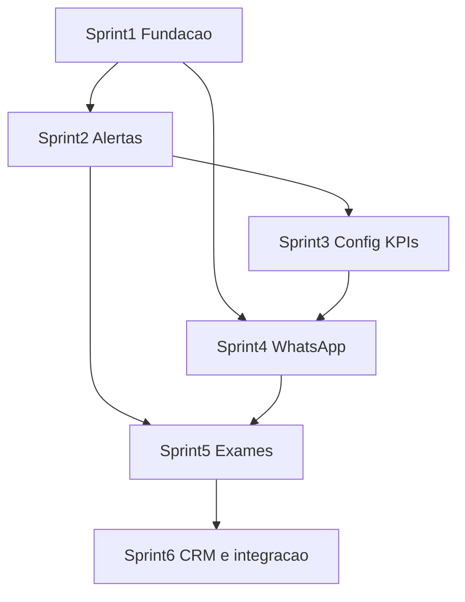

# Sprints — Dashboard hospitalar Aura Onco

Documento vivo para organizar o desenvolvimento alinhado ao plano do dashboard (Cursor: *Dashboard hospitalar Aura Onco*) e ao código em `hospital-dashboard/`, `supabase/`, `backend/`.

## Premissas

| Item | Sugestão |
|------|----------|
| Duração da sprint | 2 semanas (ajustável) |
| Cerimônias | Planejamento + revisão + retrospectiva (time define) |
| Branching | `main` protegido; features em branches por sprint ou por história |
| Definição de pronto (DoD) | Build verde (`hospital-dashboard` + `backend`), migration aplicada em projeto de dev, RLS revisado para dados sensíveis |

---

## Sprint 0 — Alinhamento e base (opcional, 1 semana)

**Objetivo:** deixar rastreabilidade e ambiente prontos antes da Sprint 1.

| Entrega | Detalhe |
|---------|---------|
| Backlog priorizado | Histórias da Sprint 1–3 no board (GitHub/Jira/Linear) |
| Ambiente | Projeto Supabase dev estável; `.env` documentado para dashboard e backend |
| Critérios de aceite | Template por história (dado / quando / então) |

**Saída:** time apto a puxar histórias sem bloqueio de credenciais.

---

## Sprint 1 — Fundação de dados e papéis

**Status:** entregue no repositório (migrations `20260413120000_sprint1_user_role_hospital_admin_enum.sql` + `20260413120100_sprint1_profiles_contact_biomarker_rls.sql` — enum em arquivo separado por exigência do Postgres), dashboard cadastro com gestor, [data-contract-dashboard.md](data-contract-dashboard.md)).

**Objetivo:** suportar **gestor vs clínica** e preparar campos para alertas e comunicação.

| ID | História | Critérios principais |
|----|----------|----------------------|
| S1-H1 | Papel institucional | Incluir papel `hospital_admin` (ou equivalente) em `user_role` + migration; documentar matriz de permissões |
| S1-H2 | RLS staff → pacientes | Políticas para gestor/clínica lerem pacientes apenas do(s) hospital(is) da lotação; revisar `biomarker_logs` / `medical_documents` para leitura controlada pelo hospital (se produto exigir) |
| S1-H3 | Contato e opt-in WhatsApp | Colunas ou tabela: telefone E.164, `whatsapp_opt_in_at`, `whatsapp_opt_in_revoked_at` em `profiles` ou entidade dedicada |
| S1-H4 | Contrato de dados | Documento curto em `docs/` listando tabelas por tela do dashboard (triagem, modal, futuro KPI) |

**DoD sprint:** migrations aplicadas em dev; smoke test no dashboard (login staff + lista pacientes sem regressão).

**Risco:** mudança de enum `user_role` pode exigir ajuste no app mobile — coordenar deploy.

---

## Sprint 2 — Motor de alertas e triagem operacional

**Status:** entregue no repositório — migration `20260414120000_sprint2_hospitals_alert_rules.sql` (`hospitals.alert_rules` JSON com `fever_celsius_min`, `alert_window_hours`); `hospital-dashboard` com badges, filtro “Só com alerta”, ordenação priorizando alertas, Supabase Realtime (debounce 800 ms) + polling 45 s com aba visível.

**Objetivo:** o caso **febre / temperatura elevada** aparecer como **alerta visível** e fila priorizada.

| ID | História | Critérios principais |
|----|----------|----------------------|
| S2-H1 | Regras de alerta | Tabela ou JSON `hospital_alert_rules` (ex.: febre: `temp >= 38` OU severidade ≥ X); fallback para regras padrão |
| S2-H2 | Vista “Alertas” ou badges | No `hospital-dashboard`, destacar pacientes com condição de alerta nas últimas 24–72 h (configurável) |
| S2-H3 | Realtime ou polling | Supabase Realtime em `symptom_logs` (filtro por pacientes do hospital) **ou** polling eficiente com debounce |
| S2-H4 | Estados de manejo (MVP) | Opcional: `alert_status` por paciente/evento (aberto / visto / resolvido) — pode ser tabela simples ou colunas em log |

**DoD sprint:** fluxo manual: registrar febre no app → ver alerta no painel em tempo aceitável (< 60 s com Realtime ou intervalo definido).

---

## Sprint 3 — Configurações e visão gestor (MVP)

**Status:** entregue no repositório — migration `20260415120000_sprint3_hospital_admin_settings_audit_rpc.sql` (RLS `UPDATE` em `hospitals` para `hospital_admin` lotado; RPC `staff_audit_logs_list`); dashboard com **Gestão** (KPIs + auditoria) e **Configurações** (edição de `alert_rules` + toggles placeholder), navegação restrita a gestor.

**Objetivo:** **Configurações** institucionais e **painel resumido** para representante do hospital.

| ID | História | Critérios principais |
|----|----------|----------------------|
| S3-H1 | Tela Configurações | Seção: limites de alerta (números), toggles de notificação (UI; persistência em `hospitals` ou tabela `hospital_settings`) |
| S3-H2 | KPIs mínimos | Cards: total de pacientes na lotação, alertas abertos (últimas 24 h), opcional contagem por severidade |
| S3-H3 | Navegação por papel | Esconder/mostrar itens (ex.: Configurações só para `hospital_admin`) |
| S3-H4 | Auditoria leitura | Lista filtrável de `audit_logs` relevantes ao hospital (pode ser somente leitura SQL via RPC com security definer) |

**DoD sprint:** usuário gestor altera um limiar e vê reflexo na triagem após reload/re-fetch; KPIs batem com query documentada.

---

## Sprint 4 — WhatsApp (backend) + chat no dashboard

**Status:** entregue no repositório — migration `20260417120000_sprint4_outbound_messages_whatsapp.sql` (`outbound_messages`, enum `WHATSAPP_OUTBOUND`); `backend` com `POST /api/whatsapp/send`, `GET|POST /api/whatsapp/webhook`; `hospital-dashboard` com bloco WhatsApp no modal (histórico + envio) e `VITE_BACKEND_URL`. Variáveis em `backend/.env.example`.

**Objetivo:** **enviar mensagem ao paciente** pelo fluxo dashboard → backend → **Cloud API**, com **auditoria**.

| ID | História | Critérios principais |
|----|----------|----------------------|
| S4-H1 | Config backend | Variáveis `WHATSAPP_*` em [backend](backend/) (token, phone_number_id, verify token webhook); não expor segredo ao front |
| S4-H2 | Endpoint `POST /whatsapp/send` (ou nome acordado) | Body: `patient_id`, `message` ou `template_name` + parâmetros; valida staff e `hospital_id`; verifica opt-in |
| S4-H3 | UI chat no modal | Área de texto + enviar; histórico de envios (últimos N) lido de `outbound_messages` ou similar |
| S4-H4 | Webhook Meta | Recebimento de status `sent/delivered/read` (atualizar registro) |
| S4-H5 | LGPD | Texto de consentimento no app + bloqueio de envio se sem opt-in |

**DoD sprint:** envio de teste para número sandbox Meta; log de auditoria sem vazar segredos; erro tratado na UI.

**Risco:** aprovação de **templates** pela Meta pode atrasar — começar com ambiente sandbox e um template genérico.

---

## Sprint 5 — Exames no prontuário e hardening

**Status:** entregue no repositório — modal do dashboard com **biomarcadores** (`biomarker_logs`) e **documentos** (`medical_documents`); abertura segura via **`GET /api/staff/exams/:id/view`** (presign R2, mesma regra que paciente mas com `staff_assignments`). Logs JSON (`logger.ts`, evento `server_listen`, `staff_exam_presign_*`). Medicamentos/nutrição: placeholders mantidos (S5-H4).

**Testes manuais (S5-H3):** abrir modal com paciente que tenha biomarcadores; documento com path R2 + `VITE_BACKEND_URL` → “Abrir” abre nova aba; path `inline-ocr/*` → só “Metadados apenas”; consola do backend mostra JSON `server_listen` ao arrancar.

**Objetivo:** fechar leitura de **exames/biomarcadores** no modal e robustez.

| ID | História | Critérios principais |
|----|----------|----------------------|
| S5-H1 | Biomarcadores no modal | Query com RLS ajustada; tabela resumida no UI |
| S5-H2 | Documentos | Lista de `medical_documents` (metadados) com link seguro se storage permitir staff |
| S5-H3 | Testes / observabilidade | Logs estruturados no backend; testes manuais documentados |
| S5-H4 | Medicamentos / nutrição | Se ainda sem schema: manter placeholders ou entregar MVP de tabela mínima conforme decisão de produto |

**DoD sprint:** revisão de segurança RLS; checklist de release.

---

## Sprint 6 — Mensagens, integração Meta (UI) e modal tipo CRM

**Status:** em curso no repositório — `hospitals.integration_settings` (JSON, ex.: `whatsapp.public_backend_url`, `whatsapp.notes`); vista **Mensagens** (lista `outbound_messages` por lotação); **Configurações** com texto Meta (sem QR no browser — QR só na app WhatsApp Business no telefone) + callback `…/api/whatsapp/webhook` copiável; modal do paciente com **abas** (Resumo, Exames e anexos, Mensagens, Diário); upload de exame pela equipe via **`POST /api/staff/ocr/analyze`** (`VITE_BACKEND_URL`). Migration alvo: `20260418120000_sprint6_hospital_integration_staff_exams.sql` (aplicar no projeto Supabase).

**Objetivo:** navegação operacional por mensagens, registo institucional das URLs Meta no hospital e prontuário com separadores + anexos OCR pela equipa.

| ID | História | Critérios principais |
|----|----------|----------------------|
| S6-H1 | Aba Mensagens | Lista filtrável de envios; clique abre paciente na aba Mensagens |
| S6-H2 | Config WhatsApp (UI) | Persistir `integration_settings.whatsapp`; explicar Cloud API vs QR; URL de webhook copiável |
| S6-H3 | Modal CRM | Abas: resumo clínico, exames/anexos + upload staff, WhatsApp, diário de sintomas |
| S6-H4 | OCR staff | Backend valida lotação; dashboard envia `imageBase64` + `mimeType` + `patient_id` |

**DoD sprint:** build verde; migration aplicada em dev; envio OCR e lista de mensagens testados com staff real.

---

## Resumo em uma página

| Sprint | Foco principal |
|--------|----------------|
| **0** | Backlog, ambiente, critérios de aceite |
| **1** | Papéis, RLS, telefone/opt-in, contrato de dados |
| **2** | Regras de alerta, fila/badges, Realtime/polling |
| **3** | Configurações, KPIs, auditoria gestor |
| **4** | WhatsApp backend + UI chat + webhook |
| **5** | Exames/biomarcadores, hardening, extensões futuras |
| **6** | Mensagens (lista), integração Meta no hospital, modal em abas, OCR staff |

## Dependências entre sprints

- **Sprint 4** beneficia-se de **S1** (opt-in/telefone) e pode começar integração sandbox em paralelo ao fim da **S2** se houver capacidade.
- **Sprint 5** assume RLS de exames alinhado com **S1**.

---

## Próximo passo imediato

1. Confirmar **duração** da sprint (1 ou 2 semanas) e **capacidade** do time.  
2. Criar histórias **S1-H1…H4** no board e estimar.  
3. Agendar **Sprint 1** com meta clara: *migration de papel + opt-in + RLS revisado*.
