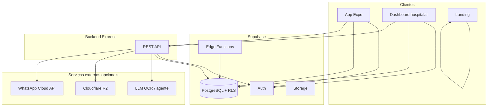
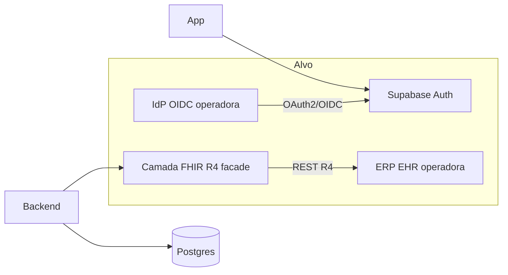

# Documento de arquitetura de software — Aura Onco (enterprise / Unimed)

**Versão:** 1.0  
**Objetivo:** suportar due diligence de TI e compliance; descrever estado atual do repositório e evolução planejada (OIDC, FHIR).

---

## 1. Visão geral

O Aura Onco é um monorepo com três frentes de cliente e um núcleo de dados:

| Componente | Tecnologia | Função |
|------------|------------|--------|
| App paciente | Expo (React Native), TypeScript | Registo de sintomas, vitais, medicamentos, tratamento, consentimentos |
| Painel institucional | Vite + React | Triagem, prontuário resumido, alertas, auditoria |
| Landing | Vite + React Router | Marketing e páginas legais |
| API de serviços | Node.js (Express) | Agente de sintomas, OCR, WhatsApp, presigned R2, webhooks |
| Dados e auth | Supabase | PostgreSQL, Auth JWT, RLS, Storage, Edge Functions |

---

## 2. Fluxo de dados (estado actual)

- O **JWT** emitido pelo Supabase Auth acompanha pedidos ao Postgres (chave anon + sessão) e ao backend (header `Authorization: Bearer`).  
- Políticas **RLS** restringem linhas por `auth.uid()` e por vínculo paciente–hospital (`staff_assignments`, etc.).

---

## 3. Camadas de segurança (resumo)

| Camada | Medida |
|--------|--------|
| Transporte | HTTPS (TLS 1.2+) entre cliente e Supabase/API |
| Autenticação | Supabase Auth; backend valida token via `getUser` |
| Autorização | RLS no PostgreSQL; rotas staff validadas no backend |
| Armazenamento de ficheiros | R2 ou fluxo com URLs assinadas; buckets não públicos por defeito |
| Alertas externos | Webhook com assinatura HMAC; payload minimizado |
| Segredos | Variáveis de ambiente; não versionados no código |

Detalhe de políticas: [`../politicas-compliance.md`](../politicas-compliance.md).

---

## 4. Arquitetura alvo B2B (OIDC + FHIR facade)

Para integração com operadoras que exijam **mesmo login** do beneficiário e **interoperabilidade HL7 FHIR**:

### 4.1 OIDC / SSO

- Configurar **provedor OpenID Connect** no Supabase (OpenID ou SAML conforme disponibilidade) com as URLs de descoberta da operadora.  
- Fluxo no app: botão “Entrar com [operadora]” (SSO) → redirect → callback → sessão Supabase.  
- Pré-requisitos: metadados do IdP (issuer, client_id, escopos), URLs de redirect permitidas, ambiente de homologação.

### 4.2 FHIR facade (fase 1)

Objetivo: expor recursos mínimos **R4** atrás de autenticação de serviço ou mútua TLS, mapeando dados já existentes:

| Recurso FHIR | Uso provável | Origem de dados (conceitual) |
|--------------|--------------|------------------------------|
| `Patient` | Identificador do beneficiário | `patients` / `profiles` (com IDs externos) |
| `Observation` | Sintomas, sinais vitais | `symptom_logs`, `vital_logs` |
| `DocumentReference` | Relatório PDF exportado | Metadados + referência ao documento |
| `CarePlan` ou `EpisodeOfCare` | Opcional, fase 2 | Tratamento / ciclos |

Implementação típica: módulo no **backend Express** ou serviço dedicado que traduz Postgres → JSON FHIR; validação com perfis nacionais (ex.: quando publicados pelo projeto de interoperabilidade em vigor).

---

## 5. Fornecedores e residência de dados

Matriz detalhada e atualização: [`due-diligence-tecnica.md`](due-diligence-tecnica.md). Em contratos enterprise, confirmar **região do projeto Supabase** e localização de **R2**, **LLM**, e **Meta WhatsApp** no RIPD e DPA.

---

## 6. Referências no repositório

- Diagrama base: [`../RELATORIO-PROJETO.md`](../RELATORIO-PROJETO.md)  
- API backend: `backend/`  
- Migrações: `supabase/migrations/`
